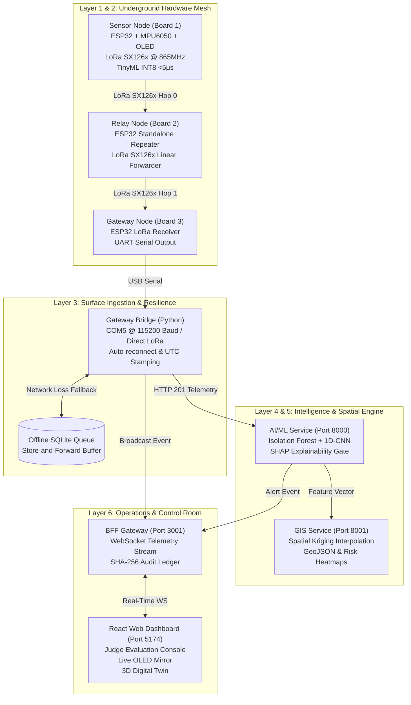

# SubSense — Smart Mine Subsidence Early-Warning Platform

[](https://opensource.org/licenses/MIT)
[]()
[]()
[]()

> **Zero-Latency, Multi-Hop Wireless Strata Deformation & Mine Subsidence Intelligence Platform**  
> Designed for Directorate General of Mines Safety (DGMS) compliance, subsurface coal seam monitoring, and life-safety evacuation in underground mining environments.

---

## 📌 Executive Summary

Underground coal mining extraction (bord-and-pillar, longwall caving) inevitably induces strata stress redistributions, resulting in catastrophic roof falls, pillar bursts, and surface subsidence troughs. Traditional monitoring relies on:
1. **Satellite InSAR**: 6-to-12 day revisit latency, incapable of immediate life-safety evacuation.
2. **Cabled Extensometers**: Extremely costly (>₹3,00,000 per borehole) with cables that shear and sever during the very first millimeters of rock shear.

**SubSense** solves this with an integrated **Edge-to-Cloud geotechnical safety platform**:
- **Underground Edge Nodes**: Low-cost (₹1,200 / node) ESP32 microcontrollers sampling inertial pitch, roll, and dynamic vibration with **quantized INT8 TinyML inference running in <5 microseconds**.
- **Multi-Hop ESP-NOW Mesh**: Linear repeater topology navigating line-of-sight mine tunnel galleries without routers or underground cables.
- **Fail-Safe Physical Siren**: Local buzzer and SSD1306 OLED safety dashboard actuating immediately underground upon physical tilt breach (>4.0°) independent of cloud or surface connectivity.
- **Surface Gateway Bridge**: Serial ingestion daemon with store-and-forward SQLite offline queue for zero data loss during network outages.
- **AI/ML Layer (FastAPI)**: Dual-tier anomaly detection (Isolation Forest + 1D-CNN) with SHAP explainability and BiLSTM forecast uncertainty cones ($P_{10}/P_{50}/P_{90}$).
- **GIS Digital Twin (FastAPI)**: Real-time Ordinary Kriging spatial interpolation estimating subsidence depth contours and risk heatmaps.
- **Web Operations Console (React + Vite)**: Multi-tenant, role-aware dashboard for Mine Operators, Geotech Planners, DGMS Regulators, and Site Administrators, featuring an interactive 3D digital twin and a live hardware OLED mirror.

---

## 🏛️ System Architecture



---

## ⚡ Core Technical Innovations

### 1. Fail-Safe Physical Priority Architecture
Underground safety must never rely on probabilistic predictions alone. In `subsense_sensor_node.ino`, the physical tilt threshold (`tilt >= 4.0°`) executes in parallel with the quantized neural network. If critical rock displacement occurs, GPIO 2 immediately fires the 2.4 kHz piezo siren in **<5 microseconds**, sounding the alert before the telemetry packet even leaves the radio buffer.

### 2. Strict Zero Data Fabrication
In mining safety, hallucinated or interpolated sensor values can lead to tragic misjudgments. The SubSense ingestion pipeline enforces **zero data fabrication**:
- Physical nodes measure pitch tilt and dynamic vibration.
- Uninstalled borehole channels (such as multipoint extensometer displacement or crack width gauges) remain strictly `null` with explicit `false` availability flags.

### 3. LoRa SX126x Linear Multi-Hop Wireless Mesh
Sub-GHz 865 MHz RF (India ISM band) penetrates through hundreds of meters of solid coal and sandstone galleries far better than 2.4 GHz WiFi. SubSense uses a LoRa SX126x P2P mesh protocol (non-LoRaWAN, matching the proven `loramain` driver):
- **Sensor Node**: Broadcasts fixed-mode LoRa telemetry at 865 MHz (22 dBm TX power, 2400 bps air speed) with sequence counter and battery voltage.
- **Relay Nodes**: Positioned around gallery turns, forwarding packets with circular deduplication caches and hop counter increments.
- **Gateway Node**: Demodulates packets, extracts hardware RSSI (`-(256 - raw)` dBm), and streams formatted JSON over USB UART to the surface bridge.

### 4. Resilient Store-and-Forward Offline Queue
If surface Ethernet or satellite links go down, the Python Gateway Bridge buffers incoming packets into an ACID SQLite database (`gateway-bridge/offline_queue.db`). A dedicated background worker continuously monitors network health and replays the queued backlog chronologically as soon as connectivity resumes—guaranteeing **zero packet loss**.

### 5. Multi-Persona Role-Based Control Room
The React dashboard supports 4 distinct operational workflows:
- **Mine Safety Operator**: Real-time sensor stream, audible alarms, physical siren silencing, and live OLED mirror.
- **Geotechnical Planner**: Downsampled historical trends, BiLSTM quantile forecast uncertainty cones, and blasting vibration correlation.
- **DGMS Safety Regulator**: Directorate General of Mines Safety compliance auditing, Form IV-B reporting, and immutable cryptographic log inspection.
- **Site Administrator**: Zero-downtime sensor onboarding and LoRa/ESP-NOW gateway latency diagnostics.

---

## 📂 Repository Structure

```
Subsense/
├── AIML data inference/         # Data engineering & inference documentation
├── ai-ml/                       # Layer 4: AI/ML Inference Service (FastAPI)
│   ├── models/                  # Isolation Forest, 1D-CNN, & BiLSTM models
│   └── src/api/                 # Telemetry ingestion, SHAP explainability
├── alerting/                    # Escalation policies, siren annunciators
├── dashboard/                   # Layer 6: Web Dashboard & BFF Monorepo
│   ├── apps/web-dashboard/      # React 18 + Vite + Tailwind dashboard
│   │   ├── src/components/      # JudgeDemoConsole, OledDisplayMirror, SubSenseLogo
│   │   └── src/views/           # SubSenseAnalyticsDashboard (Main Operations Hub)
│   ├── services/bff-gateway/    # Express + WebSocket real-time gateway (Port 3001)
│   └── DASHBOARD_FEATURES_AUDIT_REPORT.md  # Comprehensive feature audit
├── edge/                        # Layer 1 & 2: Firmware (ESP32 C/C++)
│   ├── subsense_sensor_node/    # Board 1: MPU6050 + SSD1306 OLED + TinyML
│   ├── subsense_relay_node/     # Board 2: ESP-NOW Standalone Mesh Repeater
│   └── subsense_gateway_node/   # Board 3: ESP-NOW Mesh Serial Gateway
├── gateway-bridge/              # Layer 3: Python Serial Ingestion Bridge
│   ├── bridge.py                # Serial listener, UTC stamper, SQLite queue
│   └── test_serial_sim.py       # Hardware-in-the-loop test transmitter
├── gis/                         # Layer 5: GIS Digital Twin Service (FastAPI)
│   └── src/                     # Spatial Kriging interpolation & 3D contours
├── tests/                       # End-to-end integration & hardware drill tests
├── docker-compose.yml           # Multi-container orchestration
├── JUDGE_PITCH_SCRIPT.md        # 3-Minute SIH Winning Pitch Script & Q&A Defenses
└── start_subsense_services.ps1  # One-click Windows PowerShell service launcher
```

---

## 🛠️ Hardware Requirements & Pinout

### Node 1: Sensor Node (Origin)
- **Controller**: ESP32 DevKit v1 (30-pin)
- **IMU**: MPU-6050 (6-DOF Gyroscope + Accelerometer)
  - `VCC` → `3.3V`
  - `GND` → `GND`
  - `SCL` → `GPIO 22`
  - `SDA` → `GPIO 21`
- **Display**: SSD1306 0.96" I2C OLED (Address `0x3C`)
  - `SCL` → `GPIO 22` (Shared I2C bus)
  - `SDA` → `GPIO 21` (Shared I2C bus)
- **Annunciator**: Active Buzzer / LED
  - `+` → `GPIO 2`
  - `-` → `GND`

### Node 2: Relay Node (Repeater)
- **Controller**: ESP32 DevKit v1 (Runs `subsense_relay_node_standalone.ino`)
- **Power**: 3.7V 18650 Li-Ion battery or 5V USB bank

### Node 3: Gateway Node (Surface Receiver)
- **Controller**: ESP32 DevKit v1 (Runs `subsense_gateway_node.ino`)
- **Interface**: Micro-USB / USB-C to Surface Computer on COM port (`115200` baud)

---

## 🚀 Quickstart Guide

### 1. Clone the Repository
```bash
git clone https://github.com/sasikumar161106/subsense.git
cd subsense
```

### 2. Launch All Services (One-Click)
In PowerShell:
```powershell
.\start_subsense_services.ps1
```

Or start the services individually:

#### AI/ML Inference Service (Port 8000)
```bash
cd ai-ml
python -m uvicorn models.serving.app:app --host 0.0.0.0 --port 8000
```

#### GIS Kriging Service (Port 8001)
```bash
cd gis
python -m uvicorn src.api.main:app --host 0.0.0.0 --port 8001
```

#### BFF Real-Time Gateway (Port 3001)
```bash
cd dashboard
npm run dev:bff
```

#### Web Dashboard (Port 5174)
```bash
cd dashboard
npm --workspace=apps/web-dashboard run preview -- --port 5174
```

#### Gateway Serial Bridge (COM11)
```bash
python gateway-bridge/bridge.py --port COM11 --baud 115200
```

---

## 🏆 Hackathon Demonstration Flow (SIH 2026)

Open `http://localhost:5174` in your browser:
1. **Top Evaluation Stripe**: Note the **SIH 2026 EVALUATION CONSOLE** at the top with live packet counters and scenario buttons.
2. **Bottom-Right OLED Mirror**: Shows the exact digital mirror of the physical Node 1 OLED screen (`SS-PANEL7-N042`).
3. **Trigger Collapse Drill**:
   - Click **`[3. COLLAPSE DRILL]`** on the top console.
   - The Web Audio synthesizer generates the industrial 440–880 Hz evacuation chime.
   - The OLED mirror inverts to `*** CRITICAL ALARM *** EVACUATE MINE PANEL!`.
   - The top hazardous red alert banner drops down.
4. **Silence & De-escalate**:
   - Click **`[Silence Siren]`** or **`[1. Safe (Nominal)]`** to restore nominal baseline operations.
5. **Physical Hardware Demonstration**:
   - Tilt the physical breadboard of Board 1 past 4.0°.
   - Observe the local buzzer sound immediately and the dashboard update instantaneously over serial and WebSocket.

---

## 📄 License

This project is licensed under the MIT License — see the [LICENSE](LICENSE) file for details.