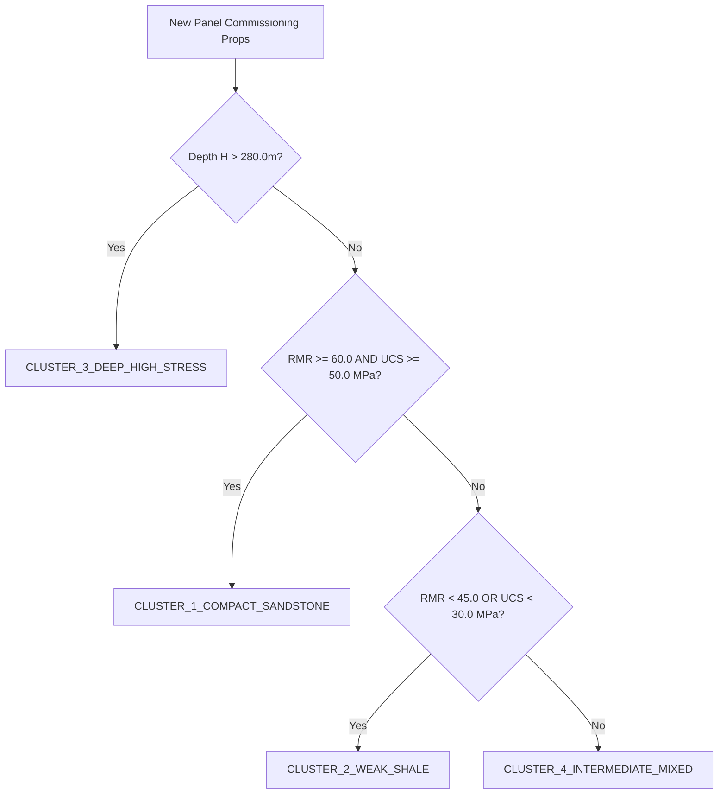

# Geological Cluster Assignment & Model Partitioning Specification

**Document ID**: `SUBSENSE-DOC-GEO-001`  
**Standard**: DGMS Circular 02 / CMR 2017 Strata Control Regulations  
**Status**: Active Production Standard  

---

## 1. Executive Summary & Regulatory Rationale

Underground coal deposits across India exhibit wide geotechnical variance:
- **Jharia / Raniganj**: Thick, massive Barakar/Raniganj sandstones prone to sudden, violent dynamic air blasts upon main fall.
- **Singareni (Godavari Valley) / Talcher**: Weak, moisture-sensitive friable shales and mudstones prone to continuous plastic convergence, bed separation, and creeping floor heave.
- **Deep Longwall Workings (>280m)**: Elevated virgin lithostatic stresses ($\sigma_v > 7.0\text{ MPa}$) inducing severe abutment pressure peaks.

Deploying a single "universal national model" across disparate coalfields inevitably compromises life safety:
1. Anomaly thresholds calibrated on creeping weak shale will flood hard sandstone mines with nuisance false alarms during routine machine vibrations.
2. Conversely, thresholds calibrated on ductile shale will dangerously under-detect sudden, brittle fracture onset in massive sandstone.

SubSense Layer 4 enforces **Panel-Cluster Model Partitioning**. Every extraction panel is partitioned into one of four geotechnical archetypes with customized kinematics ($\theta_{vel}, \theta_{accel}$), anomaly hyperparameters ($\alpha, \beta$), and GAT fracture bias weights.

---

## 2. Geological Cluster Archetypes

| Cluster Identifier | Archetype Name | Dominant Lithology | Caving Mechanism | Governed Mines (Examples) |
| :--- | :--- | :--- | :--- | :--- |
| **`CLUSTER_1_COMPACT_SANDSTONE`** | Massive Hard Sandstone | Thick Barakar Sandstone ($>70\%$ quartz), high RMR | Violent brittle overhang fracture | Jharia Seam VII, Raniganj Dishergarh |
| **`CLUSTER_2_WEAK_SHALE`** | Friable Weak Shale | Carbonaceous shale, siltstone, low compressive strength | Time-dependent ductile creep, bed sagging | Singareni Queen Seam, Talcher Seam I |
| **`CLUSTER_3_DEEP_HIGH_STRESS`** | Deep High Lithostatic Stress | Multi-seam or deep virgin strata ($>280\text{m}$) | Abutment concentration, violent floor burst | Moonidih Longwall, Churcha |
| **`CLUSTER_4_INTERMEDIATE_MIXED`** | Interbedded Sandstone-Shale | Alternating laminations of sandstone and shale | Delamination at weak bedding interfaces | Standard Gondwana baseline |

---

## 3. Mathematical Assignment Rule Hierarchy

When a new extraction panel is commissioned, the resident geotechnical manager submits its five core strata parameters:
1. Overburden Depth: $H\text{ (meters)}$
2. Seam Extraction Thickness: $M\text{ (meters)}$
3. Rock Mass Rating (Bieniawski 1989): $\text{RMR}\text{ (dimensionless, 0–100)}$
4. Uniaxial Compressive Strength of Immediate Roof: $\text{UCS}\text{ (MPa)}$
5. In-situ Young's Modulus: $E\text{ (GPa)}$

The automated assigner (`cold_start.cluster_partitioning.GeologicalClusterAssigner`) executes the following **deterministic, auditable decision hierarchy**:

### Formal Boolean Expression

$$\text{Cluster}(P) = \begin{cases}
\text{CLUSTER\_3\_DEEP\_HIGH\_STRESS} & \text{if } H > 280.0\text{ m} \\
\text{CLUSTER\_1\_COMPACT\_SANDSTONE} & \text{else if } \text{RMR} \ge 60.0 \land \text{UCS} \ge 50.0\text{ MPa} \\
\text{CLUSTER\_2\_WEAK\_SHALE} & \text{else if } \text{RMR} < 45.0 \lor \text{UCS} < 30.0\text{ MPa} \\
\text{CLUSTER\_4\_INTERMEDIATE\_MIXED} & \text{otherwise}
\end{cases}$$

---

## 4. Partitioned Hyperparameters & Deformation Regimes

Each cluster assigns tailored thresholds to the LSTM kinematics classifier, Autoencoder, and Fusion Engine:

| Hyperparameter | Description | Cluster 1 (Sandstone) | Cluster 2 (Shale) | Cluster 3 (Deep Stress) | Cluster 4 (Mixed) |
| :--- | :--- | :--- | :--- | :--- | :--- |
| $\theta_{vel}\text{ (mm/hr)}$ | Velocity threshold for `SUSTAINED` | **0.20** | **0.35** | **0.25** | **0.25** |
| $\theta_{accel}\text{ (mm/hr}^2\text{)}$ | Curvature threshold for `ACCELERATING` | **0.040** | **0.065** | **0.045** | **0.050** |
| $\alpha\text{ (ensemble)}$ | Weight of Isolation Forest vs AE | **0.60** | **0.50** | **0.55** | **0.55** |
| $\beta\text{ (scaling)}$ | Autoencoder MSE scaling factor | **14.0** | **10.0** | **13.0** | **12.5** |
| $D_{crit}\text{ (mm)}$ | Critical evacuation displacement | **20.0** | **35.0** | **22.0** | **25.0** |

---

## 5. Audit Logging & Retraining Protocols

1. **Panel Inception Audit**: Upon assignment, the system generates a cryptographically signed revision entry in `logs/audit_ledger.json` recording the assigned cluster and governing criteria.
2. **Empirical Calibration**: If 30 consecutive operating days yield zero false alarms and stable PDR $>96.5\%$, the panel weights are fine-tuned via the weekly Airflow retraining DAG (`dags.weekly_subsense_retraining`).
