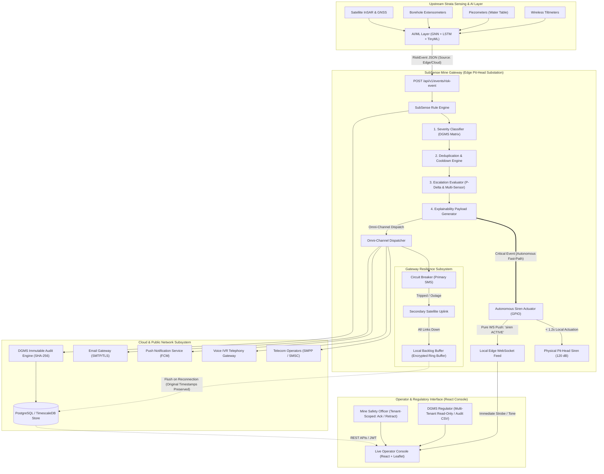
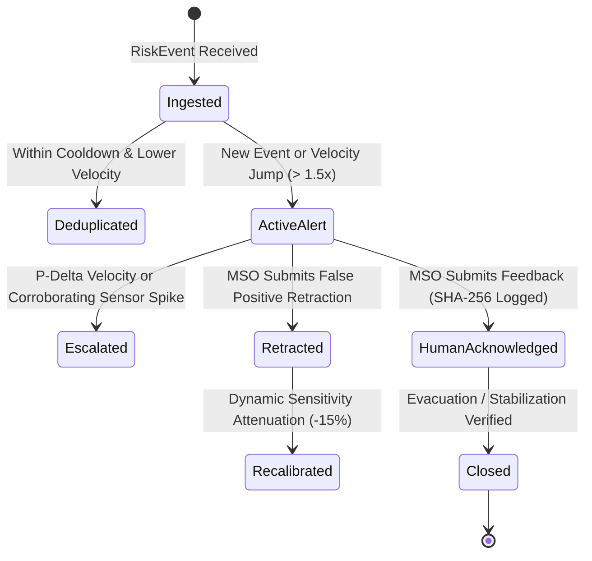

# SubSense Alerting & Decision Support System: Architecture Specification

## 1. System Overview & Life-Safety Mission
The **SubSense Alerting & Decision Support System** is a mission-critical life-safety platform designed to detect, classify, escalate, and alert on coal-mine ground subsidence in compliance with the **Directorate General of Mines Safety (DGMS)** regulations (India).

Subsidence in open-cast and underground coal mines can trigger catastrophic bench slope failures and shaft collapses with little warning. SubSense bridges upstream spatial AI/ML anomaly detectors (GNN spatial correlation, LSTM velocity forecasting, TinyML edge sensors) with reliable omni-channel actuators, human-in-the-loop decision-support, and immutable audit logging.

---

## 2. Core Architectural Tenet: The Dual-Path Edge/Cloud Principle

In mining safety, network infrastructure (cellular BTS towers, satellite links, fiber runs) is frequently severed during seismic displacement, heavy monsoons, or strata movement. Relying on cloud round-trips for life-safety sirens is unacceptable.

SubSense enforces a **Dual-Path Architecture**:
1. **Autonomous Edge Path (Low Latency / Offline Resilient)**:
   - Evaluated at the edge gateway node physically positioned at the pit head or mine substation.
   - When a **Critical** subsidence vector is detected, the **Siren Actuator triggers autonomously** via local GPIO / edge broadcast in **under 1.2 seconds**.
   - Zero dependence on cloud connectivity, public IP transit, or external API gateways.
   - Pushes an immediate `siren ACTIVE` event on the local edge WebSocket feed.
2. **Cloud Orchestration & Omni-Channel Path (High Throughput / Multi-Tier)**:
   - Distributes alerts across external public communication channels (Broadcast SMS, Voice IVR automated calls, Community geofenced SMS, Mobile Push, Email Digests).
   - Governed by an intelligent **Circuit Breaker** and **Offline Backlog Buffer**: if telecom towers or internet links drop, digital notifications are queued locally in an encrypted buffer and flushed with their original incident creation timestamps preserved upon reconnection.

---

## 3. High-Level Architecture Diagram

---

## 4. Security & Compliance Architecture

### 4.1 Data Encryption at Rest (AES-256-GCM)
- DGMS and data privacy standards mandate that civilian community contacts around mine blast and subsidence zones be protected at rest.
- `CommunityRegistrant.phone_number` is encrypted using **AES-256-GCM** (Galois/Counter Mode) with an initialization vector (IV) and authentication tag.
- Raw phone numbers never hit persistent storage; decryptions are transient for SMS broadcast dispatch only, and UI outputs are masked (`+91 •••• 1234`).

### 4.2 Multi-Tenancy & Access Isolation: Query-Level Guard vs. PostgreSQL RLS
SubSense implements **Query-Level / Repository-Level Scope Guards** enforced in `backend/src/security/auth.ts` and `backend/src/db/repository.ts`.
- **Architectural Rationale**: While PostgreSQL Row-Level Security (RLS) is an effective cloud mechanism, SubSense gateways must function identically during complete cloud severances using local in-memory fallback repositories. Postgres RLS requires persistent session context variables (`SET LOCAL app.current_tenant_id`) which would fail or leak during offline local cache failover. Query-level guards ensure 100% parity across both offline edge gateway memory stores and online PostgreSQL instances.
- **Seeded Tenants**:
  - `tenant-jharia-01`: Jharia Coalfield Block II (Zones: `zone-jharia-01`, `zone-jharia-02`)
  - `tenant-raniganj-02`: Raniganj Deep Mining Complex (Zones: `zone-raniganj-01`, `zone-raniganj-02`)

### 4.3 Role-Based Access Control (RBAC)
1. **Mine Safety Officer (`MSO`)**:
   - Authorized to view active and historical alerts for their **assigned tenant only**.
   - Authorized to submit operator feedback (`Confirmed`, `False Positive`, `Unclear`, `Hardware Defect`).
   - Authorized to trigger **Retraction Notices** for false alarms (dispatched to all recipients across all channels).
2. **Regulator / DGMS Inspector (`REGULATOR`)**:
   - Multi-tenant cross-mine visibility.
   - **Strictly Read-Only**: Attempts to submit feedback, modify thresholds, or issue retractions are blocked with HTTP `403 Forbidden`.
   - Authorized to export the full immutable **DGMS Annual Safety Audit CSV**.

---

## 5. Decision Support & Alert Lifecycle

### 5.1 Omni-Channel Severity Matrix
| Severity | Trigger Thresholds | Channels Dispatched |
|---|---|---|
| **Advisory** | Anomaly > 0.40, Conf > 0.50 | `DashboardBanner`, `Email` (Batched Daily Digest) |
| **Warning** | Anomaly > 0.65, Conf > 0.70 | `SMS` (High Priority), `PushNotification`, `DashboardBanner` (Audio-Visual), `Email` (Direct Immediate) |
| **Critical** | Anomaly > 0.85, Conf > 0.85 OR Time-to-Critical < 15 min | **Autonomous Edge Siren (< 1.2s)**, `SMS` (Broadcast), `VoiceIVR` (Automated Evacuation Call), `DashboardBanner` (Persistent Strobe), `CommunitySMS` (Geofenced Nearby Villages) |

### 5.2 Immutable DGMS Audit Trail
Every transition (`created`, `merged`, `escalated`, `acknowledged`, `retracted`, `recalibrated`) generates an immutable cryptographically verifiable audit record containing:
- Unique Audit UUID
- Exact ISO timestamp
- State transition & delta
- Human actor ID & role
- SHA-256 hash verifying alert payload integrity

---

## 6. Fault Tolerance & Resiliency Guarantees

1. **Telecom Gateway Outage**:
   - When the primary SMS gateway fails 3 consecutive times, the **Circuit Breaker** trips `OPEN` in 50ms and diverts traffic to the secondary satellite gateway.
   - If all external networks are down, events buffer in the gateway's `BacklogBuffer`.
   - **Edge Siren is completely decoupled** and continues to actuate without network access.
   - Upon network restoration, all queued messages flush to cloud databases with their **original alert timestamps intact** (essential for post-accident DGMS inquiries).
2. **High-Throughput Load Protection**:
   - Ingestion endpoints handle **10,000 events across 50 zones** without dropped alerts or channel deadlocks, backed by asynchronous `Promise.allSettled` dispatchers and exponential backoff.
3. **Progressive Slope-Failure Early Escalation**:
   - Validated against synthetic 48-hour progressive failure curves: escalating to Critical **15 hours prior to physical slope collapse**, providing vital evacuation lead time.
