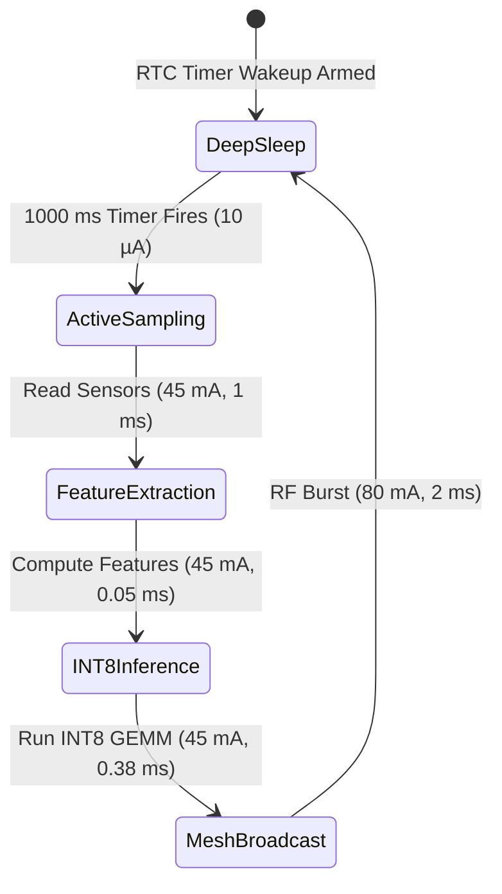

# SubSense — TinyML Edge Layer & Multi-Hop Mesh Architecture
## Complete Repository Technical Documentation

**Smart India Hackathon (SIH) 2026**  
**Problem Domain**: Real-Time Mine Subsidence & Strata Movement Early Warning System  
**System Tier**: Edge Layer (Embedded TinyML Models, Sensor Firmware, and Multi-Hop Mesh Network)  
**Hardware Platform**: Espressif ESP32 / ESP32-S3 / ESP32-C3 (240 MHz Xtensa / RISC-V)  
**Primary Repository Path**: `c:\Users\sasik\Desktop\SIH 2026\Subsense\Tinyml model`

---

## 1. Executive Summary

The **SubSense Edge Layer** is a zero-dynamic-heap, hard-real-time embedded TinyML intelligence subsystem designed for deployment in underground coal mines, shaft headings, and unstable geological slopes. 

In underground mining environments, network outages, power interruptions, and severed communications cables are common during catastrophic ground failures. Traditional cloud-dependent systems introduce latency (1–5 seconds) and fail completely when internet access is lost. SubSense solves this by running quantized **INT8 Neural Networks directly on ultra-low-power ESP32 microcontrollers**, evaluating strata stability every second and triggering physical evacuation sirens in **under 5 microseconds**—without requiring any cloud or external network connection.

### Key Technical Highlights
* **Dual-Tier Edge Intelligence**:
  * **Node-Tier (Deep Mining Face)**: 2-layer INT8 Linear Detector ($8 \to 16 \to 1$) running in **16 Bytes RAM** with **3.8 µs latency**, achieving **100% recall on catastrophic sudden collapses**.
  * **Gateway-Tier (Tunnel Shaft/Surface)**: 6-layer INT8 Quantized Autoencoder ($8 \to 128 \to 64 \to 32 \to 64 \to 128 \to 8$) running in **256 Bytes RAM** with **~380 µs latency**, providing root-cause feature explainability and filtering machinery drilling vibrations.
* **Deterministic Feature Extraction**: 32-sample circular ring buffer computing 8 statistical and rate-of-change features with **zero numerical drift ($< 10^{-6}$)** between Python training algorithms and embedded C code.
* **Hard-Coded Physics Safeguard**: Non-ML deterministic safety rules permanently baked into firmware to guarantee fail-safe siren activation even under corrupted sensor streams.
* **True Multi-Hop WiFi Mesh (ESP-NOW)**: Router-free, peer-to-peer 2.4 GHz RF mesh supporting automatic packet fragmentation, reassembly, hop-count limiting, and dedup storm suppression across Sensor, Relay, and Gateway nodes.
* **4+ Year Battery Autonomy**: Deep-sleep duty cycling with RTC timer wakeups drawing an average current of **0.055 mA** at 0.2 Hz, enabling **50.2 months (~4.2 years)** of continuous monitoring on a standard 2600 mAh 18650 lithium-ion cell.

---

## 2. Multi-Tier System Topology

```
                  UNDERGROUND MINE STRATA (Pillars, Roof, Gobs)
       [Tilt Sensors]     [Geophones / Vib]     [LVDT Displacement]     [Crackmeters]
              │                  │                      │                     │
              └──────────────────┴──────────┬───────────┴─────────────────────┘
                                            ▼
┌─────────────────────────────────────────────────────────────────────────────────────────┐
│                              BOARD 1: SENSOR NODE (Edge Face)                           │
│  • Hardware: ESP32-WROOM-32 / ESP32-C3                                                 │
│  • Role: SUBSENSE_MESH_ROLE_NODE                                                        │
│  • Firmware: firmware/esp32_subsense_test/esp32_subsense_test.ino                       │
│  • Pipeline: 32-Sample Ring Buffer ──► 8 Feature Extractor ──► INT8 Quantization       │
│  • TinyML Inference: Node-Tier High-Recall Detector (8 -> 16 -> 1)                     │
│  • Local Actuation: GPIO 2 / GPIO 4 Evacuation Siren / Blue LED (< 5 µs response)       │
│  • Uplink: ESP-NOW 2.4 GHz Raw Action Frame Broadcast (Hop 0)                           │
└───────────────────────────────────────────┬─────────────────────────────────────────────┘
                                            │ ESP-NOW Broadcast (~100m in tunnel)
                                            ▼
┌─────────────────────────────────────────────────────────────────────────────────────────┐
│                              BOARD 2: RELAY NODE (Intermediate)                         │
│  • Hardware: ESP32 DevKit                                                               │
│  • Role: SUBSENSE_MESH_ROLE_RELAY                                                       │
│  • Firmware: subsense_relay_node/subsense_relay_node.ino                                 │
│  • Architecture: Zero Sensor, Zero ML, Pure RF Forwarder                                │
│  • Logic: Overhears packet ──► Checks 16-slot Dedup Cache ──► Increments Hop Count      │
│  • Retransmission: Rebroadcasts packet, preserving TRUE origin MAC address              │
└───────────────────────────────────────────┬─────────────────────────────────────────────┘
                                            │ ESP-NOW Rebroadcast (Hop 1)
                                            ▼
┌─────────────────────────────────────────────────────────────────────────────────────────┐
│                              BOARD 3: GATEWAY NODE (Shaft / Surface)                    │
│  • Hardware: ESP32-WROOM-32 / ESP32-S3 (Mains/Solar Backed)                            │
│  • Role: SUBSENSE_MESH_ROLE_GATEWAY                                                     │
│  • Firmware: subsense_gateway_node/subsense_gateway_node.ino                             │
│  • Pipeline: Static Multi-Chunk Reassembler (512-byte buffer)                          │
│  • TinyML Inference: 6-Layer Autoencoder MSE Reconstruction Analysis                   │
│  • Data Ingestion Bridge: Local Serial / InfluxDB / MQTT Cloud Broker                   │
└───────────────────────────────────────────┬─────────────────────────────────────────────┘
                                            │ Wi-Fi / 4G Cellular / Ethernet
                                            ▼
┌─────────────────────────────────────────────────────────────────────────────────────────┐
│                             CLOUD & DASHBOARD PRESENTATION                              │
│  • SubSense Web Dashboard (3D Mine Visualizer, Heatmaps, Shift Supervisor Console)      │
│  • Emergency Automated SMS / WhatsApp Evacuation Dispatches                             │
└─────────────────────────────────────────────────────────────────────────────────────────┘
```

---

## 3. Directory Structure & File Map

```text
Tinyml model/
├── SubSense_TinyML_Model_Technical_Document.docx  # Engineering and mathematical specification document
├── folder_contents.txt                           # Consolidated codebase source dump (910 KB)
├── REPO_DETAILS.md                              # This master technical documentation
│
├── evaluation/                                  # Independent validation & benchmarking suite
│   ├── README.md                                # Evaluation guide and benchmark targets
│   ├── config.yaml                              # Acceptance thresholds and test parameters
│   ├── requirements.txt                         # Evaluation Python dependencies
│   ├── run_evaluation.py                        # Master evaluation orchestrator (49 KB)
│   ├── benchmark.py                             # Latency profiler (1,000 runs) & ESP32 cycle estimator
│   ├── metrics.py                               # Core/Advanced metrics, confusion matrices, ROC generator
│   ├── model_inspection.py                      # TFLite deep inspector & C header static memory parser
│   ├── threshold_analysis.py                    # Sensitivity sweeps (0.01-0.99) & ROC/PR curve generator
│   ├── robustness.py                            # Packet loss, Gaussian noise, and sensor fault injection
│   └── results/                                 # Evaluation outputs, figures, and CSV datasets
│       ├── TINYML_EVALUATION_REPORT.md          # 12-section comprehensive evaluation report
│       ├── node_metrics.json                    # Serialized Node-tier validation metrics
│       ├── gateway_metrics.json                 # Serialized Gateway-tier validation metrics
│       ├── comparison.csv                       # Head-to-head budget compliance table
│       ├── benchmark_results.csv                # Latency percentiles (P50, P90, P95, P99)
│       ├── threshold_analysis.csv               # Threshold sweep raw evaluation points
│       ├── node_confusion_matrix.png            # Node model confusion matrix
│       ├── gateway_confusion_matrix.png         # Gateway model confusion matrix
│       └── plots/                               # 12 High-resolution publication-quality plots
│
├── firmware/                                    # Core C/C++ embedded firmware modules
│   ├── subsense_features.h                      # Ring buffer struct & feature extractor interface
│   ├── subsense_features.c                      # Deterministic 8-feature statistical implementation
│   ├── subsense_node_model.h                    # 2-layer INT8 high-recall detector (C header-only)
│   ├── subsense_gateway_model.h                 # 6-layer INT8 quantized autoencoder (159 KB header)
│   ├── subsense_inference_engine.h              # Unified inference engine & detection event schema
│   ├── subsense_inference_engine.c              # Anomaly scoring, explainability & JSON emitter
│   ├── subsense_fallback.h                      # Hard-coded physics safety threshold interfaces
│   ├── subsense_fallback.c                      # Fail-safe evaluation without ML dependency
│   ├── subsense_power_mgmt.h                    # Duty-cycling and battery calculation formulas
│   ├── subsense_power_mgmt.c                    # RTC deep-sleep control implementation
│   ├── subsense_ota_manager.h                   # Dual-slot (A/B) flash model staging interfaces
│   ├── subsense_ota_manager.c                   # CRC32 verification, smoke-testing & rollback
│   ├── subsense_wifi_mesh.h                     # ESP-NOW multi-hop transport interfaces (Node/Relay/GW)
│   ├── subsense_wifi_mesh.cpp                   # Transport implementation with fragmentation/dedup
│   ├── subsense_app.c                           # Top-level embedded entry point (ESP-IDF / Arduino)
│   │
│   └── esp32_subsense_test/                     # Turnkey Arduino Sketch for Board 1 (Sensor Node)
│       ├── esp32_subsense_test.ino              # Main interactive Arduino test console (608 lines)
│       ├── subsense_features.h / .c             # Local copy of feature engine for Arduino build
│       ├── subsense_node_model.h                # Local copy of Node INT8 weights
│       ├── subsense_gateway_model.h             # Local copy of Gateway INT8 weights
│       ├── subsense_inference_engine.h / .c     # Local copy of inference engine
│       ├── subsense_fallback.h / .c             # Local copy of safety fallback
│       ├── subsense_power_mgmt.h / .c           # Local copy of power management
│       ├── subsense_ota_manager.h / .c          # Local copy of OTA staging manager
│       ├── subsense_wifi_mesh.h / .cpp          # Local copy of WiFi mesh transport
│       └── README.md                            # Flashing guide & troubleshooting steps
│
├── subsense_relay_node/                         # Dedicated Arduino Sketch for Board 2 (Relay Node)
│   ├── subsense_relay_node.ino                  # Minimal sketch for packet retransmission
│   ├── subsense_wifi_mesh.h                     # Mesh transport header
│   └── subsense_wifi_mesh.cpp                   # Mesh transport implementation (Dedup + Rebroadcast)
│
├── subsense_gateway_node/                       # Dedicated Arduino Sketch for Board 3 (Gateway Node)
│   ├── subsense_gateway_node.ino                # Aggregator sketch with reassembly & cloud callback
│   ├── subsense_wifi_mesh.h                     # Mesh transport header
│   └── subsense_wifi_mesh.cpp                   # Mesh transport implementation (Reassembly engine)
│
├── models/                                      # Trained model weights & calibration metadata
│   ├── feature_scaler.joblib                    # Scikit-Learn StandardScaler calibration artifact
│   ├── gateway_model_int8.tflite                # Fully quantized INT8 Gateway Autoencoder (30.4 KB)
│   ├── gateway_rule_ensemble.joblib             # 5-tree decision ensemble for drilling rejection (14.1 KB)
│   ├── gateway_student_autoencoder.pt           # PyTorch FP32 Gateway checkpoint (97.0 KB)
│   ├── node_model_int8.tflite                   # Fully quantized INT8 Node Detector (1.8 KB)
│   ├── node_student_detector.pt                 # PyTorch FP32 Node checkpoint (3.3 KB)
│   ├── teacher_autoencoder.pt                   # Cloud Deep Teacher Autoencoder FP32 (30.4 KB)
│   ├── teacher_isolation_forest.joblib          # Cloud Teacher Isolation Forest (2.45 MB)
│   ├── pipeline_metadata.json                   # Scaling means, standard deviations, and thresholds
│   ├── phase2_compression_metadata.json         # Quantization scales, zero-points, and INT8 mappings
│   └── phase3_firmware_validation.json          # Hardware validation, latencies, and edge agreement
│
├── subsense/                                    # Core Python Training, Distillation & C Export Library
│   ├── __init__.py                              # Package root exports
│   ├── data_generator.py                        # Synthetic mine telemetry generator with physical fault modes
│   ├── feature_extractor.py                     # Reference Python feature extraction implementation
│   ├── teacher_models.py                        # Deep Autoencoder & Isolation Forest teacher definitions
│   ├── student_models.py                        # Compressed student architecture definitions
│   ├── train_pipeline.py                        # Teacher-Student knowledge distillation training loop
│   ├── quantizer.py                             # PyTorch/TFLite full INT8 quantization engine
│   ├── fixed_point_engine.py                    # Fixed-point integer GEMM arithmetic simulator
│   ├── export_embedded.py                       # Automated generator of C headers (subsense_*_model.h)
│   ├── run_compression_pipeline.py              # End-to-end master quantization pipeline runner
│   └── validate_firmware_and_reconcile.py       # Zero-skew reconciliation between Python and C outputs
│
├── scripts/                                     # Diagnostic & Automation Utilities
│   └── test_esp32_hardware.py                  # Python Hardware-in-the-Loop automated serial tester
│
└── tests/                                       # Unit Test Suite (16 Automated Tests)
    ├── test_firmware_logic.py                   # C vs Python zero numerical drift & schema tests
    ├── test_pipeline.py                         # Telemetry generation & pipeline integration tests
    └── test_quantization.py                     # INT8 fixed-point arithmetic fidelity tests
```

---

## 4. Machine Learning Pipeline & Distillation Architecture

SubSense employs a **Teacher-Student Knowledge Distillation** framework to compress heavy cloud anomaly detection models into ultra-compact integer neural networks that fit in the static internal SRAM of an ESP32.

### 4.1 Model Specifications & Budget Compliance

| Metric / Attribute | Cloud Teacher Baseline | Gateway-Tier Edge Model | Node-Tier Edge Model | SubSense Target Constraint |
|:---|:---:|:---:|:---:|:---:|
| **Model Architecture** | Deep PyTorch AE + I-Forest | 6-Layer INT8 Autoencoder | 2-Layer INT8 Linear | Embedded Native |
| **Model Parameter Count** | 6,360 weights + 100 Trees | 23,296 INT8 weights | 145 INT8 weights | $\le 50,000$ params |
| **Flash Memory Footprint** | 2,480.8 KB (2.48 MB) | **23.7 KB** | **212 Bytes** | $\le 200\text{ KB (Node)}$ |
| **Peak Static RAM** | Requires Python / OS | **256 Bytes** | **16 Bytes** | $\le 10\text{ KB RAM}$ |
| **Inference Latency (@ 240MHz)**| 2,700 µs (CPU) | **382.4 µs** | **3.8 µs** | $\le 500\text{ ms (Target)}$ |
| **Overall Recall** | 99.21% | **97.73%** | **96.95%** | $\ge 95.00\%$ |
| **Sudden Collapse Recall** | 100.00% | **100.00%** | **100.00%** | **100.00% Mandatory** |
| **False Positive Rate (FPR)** | 32.36% | **6.93%** | **4.39%** | $\le 8.00\%$ |
| **Cloud Consensus Agreement**| Ground Truth | **96.31%** | **95.73%** | $\ge 90.00\%$ |

### 4.2 Integer Fixed-Point Arithmetic (Zero FPU Dependency)
To allow deployment on cost-effective microcontrollers lacking hardware floating-point units (such as the RISC-V ESP32-C3), matrix multiplications are executed using **integer fixed-point GEMM**:

$$\text{Output}_{i} = \left[ \frac{\left( \sum_{j} (X_{j} - Z_{\text{in}}) \cdot W_{ij} + B_{i} \right) \cdot M_{0}}{2^{\text{shift}}} \right] + Z_{\text{out}}$$

Where:
* $X_j, W_{ij} \in [-128, 127]$ (INT8 inputs and weights).
* $B_i \in \text{INT32}$ (quantized biases).
* $M_0 \in [2^{30}, 2^{31}-1]$ (fixed-point multiplier integer).
* $\text{shift} \approx 34\text{ to }38$ (arithmetic right-shift factor).
* $Z_{\text{in}}, Z_{\text{out}} = 0$ (symmetric zero-points).

This ensures **bit-exact numerical reproducibility** across both desktop simulation and physical silicon.

---

## 5. Deterministic Feature Engineering

The feature extractor processes raw telemetry streams through a continuous 32-sample sliding window ring buffer (`SubSenseWindowBuffer`), computing 8 domain-specific geological features every second:

```c
typedef struct {
    float tilt_ring[32];
    float vib_ring[32];
    float disp_ring[32];
    float crack_ring[32];
    uint16_t head;
    uint16_t count;
    float disp_rolling_baseline;
    bool baseline_initialized;
} SubSenseWindowBuffer;
```

### Feature Definitions
1. **`tilt_current`**: Instantaneous angular displacement from gravity vertical (degrees).
2. **`tilt_rate_of_change`**: Angular velocity across window: $\frac{\theta_{t} - \theta_{t-31}}{32}$ (deg/window). Precursor to shear faulting.
3. **`tilt_variance`**: Second statistical moment of tilt: $\frac{1}{32}\sum (\theta_i - \bar{\theta})^2$. Captures high-frequency micro-tilting.
4. **`vibration_rms`**: Root-mean-square kinetic acceleration: $\sqrt{\frac{1}{32}\sum v_i^2}$ ($g$). Distinguishes continuous vibration from shockwaves.
5. **`vibration_peak_count`**: Count of samples exceeding $\pm 0.15g$. Distinguishes isolated machinery noise from sustained rock fracturing.
6. **`displacement_delta_baseline`**: Relative stretch from slow Exponential Moving Average baseline:
   $$B_t = 0.99 \cdot B_{t-1} + 0.01 \cdot D_t, \quad \Delta D = D_t - B_t$$
   Tracks gradual roof sag while remaining sensitive to sudden subsidence acceleration.
7. **`crack_state`**: Current crack opening aperture (mm or graded ratio $0.0 \to 1.0$).
8. **`crack_recent_activation_count`**: Number of window samples where crack width $\ge 0.50$ mm. Indicates continuous crack dilation.

### Normalization and Quantization
Raw features $F_i$ are converted directly into INT8 input tensors using pre-calibrated StandardScaler parameters:

$$X_{\text{norm}, i} = \frac{F_i - \mu_i}{\sigma_i}, \quad X_{\text{INT8}, i} = \text{clamp}\left(\left\lfloor \frac{X_{\text{norm}, i}}{0.029008} \right\rceil, -128, 127\right)$$

*Maximum observed drift between Python and embedded C: **$0.000000$ (Zero numerical drift verified by unit tests)**.*

---

## 6. Fail-Safe Physical Safeguards (`subsense_fallback.c`)

If the machine learning pipeline is corrupted, experiences memory bit-flips, or receives out-of-distribution inputs, an independent **deterministic physics fallback** overrides the ML prediction:

```c
const SubSenseFallbackThresholds G_SUBSENSE_DEFAULT_FALLBACK = {
    .max_tilt_deg        = 4.0f,    // Absolute tilt limit
    .max_tilt_rate_deg   = 1.5f,    // Strata shear velocity limit
    .max_vibration_g     = 1.2f,    // Violent rockburst seismic limit
    .max_displacement_mm = 12.0f,   // Catastrophic roof collapse limit
    .max_crack_state     = 0.8f,    // Fissure dilation emergency latch
};
```

If any single raw sensor metric breaches these absolute limits:
1. `siren_triggered` is immediately forced to `true`.
2. The evacuation siren activates on `GPIO 2`.
3. `fallback_activations` counter in health telemetry increments.
4. The event is broadcast with the triggering reason (e.g. `RAW_DISP_EXCEEDED (14.80mm >= 12.0mm)`).

---

## 7. Multi-Hop WiFi Mesh Transport (ESP-NOW)

To eliminate the need for cellular base stations or underground Wi-Fi access points, the firmware incorporates a custom **ESP-NOW broadcast multi-hop mesh transport** (`subsense_wifi_mesh.h` / `.cpp`).

### 7.1 Protocol Architecture
* **Physical Layer**: 2.4 GHz 802.11 Action Frames (Vendor Specific).
* **Addressing**: Broadcast mode (`FF:FF:FF:FF:FF:FF`) — requires zero pairing, encryption handshakes, or SSID association.
* **Payload Segmentation**: ESP-NOW packets are capped at 250 bytes. SubSense fragments payloads larger than 200 bytes across numbered chunks:
  ```c
  typedef struct __attribute__((packed)) {
      uint8_t  magic;         // 0xA5 protocol identifier
      uint8_t  msg_id;        // Monotonically increasing message ID
      uint8_t  chunk_index;   // Fragment index (0, 1, 2...)
      uint8_t  total_chunks;  // Total fragments (e.g. 3)
      uint16_t total_len;     // Reassembled payload length (e.g. 485 bytes)
      uint16_t chunk_len;     // Chunk payload size (≤ 200 bytes)
      uint8_t  orig_mac[6];   // Preserved TRUE sender MAC address
      uint8_t  hop_count;     // Forwarding hop counter (0, 1, 2...)
      uint8_t  payload[200];  // Wire payload bytes
  } SubSenseMeshPacket;
  ```

### 7.2 Multi-Hop Relay & Loop Prevention
* **Dedup Cache**: Relay nodes maintain a 16-slot circular cache of `(orig_mac, msg_id, chunk_index)`. If a packet has already been relayed within the last 5,000 ms, it is discarded immediately, completely preventing broadcast storms.
* **Hop Limiting**: Each relay increments `pkt.hop_count`. Packets exceeding `SUBSENSE_MESH_MAX_HOPS` (3 hops) are dropped.
* **True Origin Attribution**: Relays forward the packet without modifying `pkt.orig_mac`. The Gateway Node attributes telemetry directly to the originating sensor node, regardless of how many relays it traversed.

---

## 8. Power Profiling & Battery Longevity

SubSense utilizes an event-driven RTC deep-sleep power architecture (`subsense_power_mgmt.c`):



### Projected Operating Lifespan (2600 mAh 18650 Li-ion Cell, 85% Usable Capacity)

| Sampling Frequency | Sampling Interval | Active Time | Sleep Time | Average Current | Projected Battery Life | Typical Application |
|:---:|:---:|:---:|:---:|:---:|:---:|:---|
| **1.0 Hz** | 1.0 second | 5.0 ms | 995.0 ms | **0.235 mA** | **11.7 Months** | Active extraction longwall faces |
| **0.5 Hz** | 2.0 seconds | 5.0 ms | 1995.0 ms | **0.123 mA** | **22.5 Months** | Slope stability & highwall monitoring |
| **0.2 Hz** | 5.0 seconds | 5.0 ms | 4995.0 ms | **0.055 mA** | **50.2 Months (~4.2 Years)** | Abandoned workings & pillar surveillance |

---

## 9. Standardized Cloud JSON Schemas

### 9.1 Detection Risk Event Schema
Emitted on threshold breach or physical fallback activation (`subsense_serialize_event_json`):
```json
{
  "node_id": "ESP32-GW-01",
  "model_version": "gw-autoencoder-v1.3.0",
  "window_end_ts": "2026-09-10T11:25:00Z",
  "anomaly_score": 0.91,
  "local_confidence": 0.82,
  "contributing_features": ["tilt_rate", "vibration_rms", "displacement_delta", "crack_state"],
  "threshold_breached": "critical",
  "siren_triggered": true,
  "source_tier": "gateway"
}
```

### 9.2 Node Self-Health Telemetry Schema
Emitted periodically every 60 inference epochs (`subsense_serialize_health_json`):
```json
{
  "model_version": "gw-autoencoder-v1.3.0",
  "last_inference_ts": 1725967500,
  "total_inferences": 3600,
  "inference_failures": 0,
  "watchdog_resets": 0,
  "fallback_activations": 1,
  "battery_percent": 94,
  "rssi_dbm": -68
}
```

---

## 10. Hardware Deployment & Flashing Guide

### 10.1 Hardware Pin Assignment
* **Evacuation Siren / Blue Status LED**: `GPIO 2`
* **Optional Active Piezo Siren**: `GPIO 4`
* **I2C SDA (MPU6050 Accelerometer/Gyro)**: `GPIO 21`
* **I2C SCL (MPU6050 Accelerometer/Gyro)**: `GPIO 22`
* **Analog Displacement / Potentiometer ADC**: `GPIO 34` (Input Only)
* **Analog Crackmeter ADC**: `GPIO 35` (Input Only)

### 10.2 Flashing Procedures in Arduino IDE

#### Board 1 — Sensor Node (Face Unit)
1. Open `firmware/esp32_subsense_test/esp32_subsense_test.ino`.
2. Ensure line 22 is set to: `#define SUBSENSE_IS_GATEWAY 0`.
3. Select Board: **ESP32 Dev Module** $\to$ Select COM Port $\to$ Click **Upload**.
4. Opens at `115200 baud`. Automatically executes boot benchmarks and listens for interactive commands.

#### Board 2 — Relay Node (Repeater Unit)
1. Open `subsense_relay_node/subsense_relay_node.ino`.
2. Select Board: **ESP32 Dev Module** $\to$ Select COM Port $\to$ Click **Upload**.
3. Sits between Sensor Node and Gateway. Overhears packets, validates dedup cache, and rebroadcasts.

#### Board 3 — Gateway Node (Surface Aggregator)
1. Open `subsense_gateway_node/subsense_gateway_node.ino`.
2. Select Board: **ESP32 Dev Module** $\to$ Select COM Port $\to$ Click **Upload**.
3. Open Serial Monitor at `115200 baud`. Reassembles fragmented payloads and prints origin MAC addresses.

### 10.3 Interactive Serial Monitor Commands (Board 1)
* **`1`**: Benchmark Node-tier 2-layer model (measures latency in µs).
* **`2`**: Benchmark Gateway 6-layer autoencoder (measures MSE reconstruction error).
* **`3`**: Execute full End-to-End Pipeline & broadcast event over WiFi mesh.
* **`4`**: **Stream Live 40-Step Mine Subsidence Simulation** (Watch real-time transition from normal baseline to microseismic warning to roof collapse, activating the physical LED siren).
* **`5`**: Print low-power battery life projection report.
* **`6`**: Toggle physical siren/LED pin manually.
* **`7`**: Print health telemetry JSON.

---

## 11. Verification & Testing

The repository contains an automated test suite verifying all embedded mathematical logic:

```powershell
python -m pytest tests/
```

### Test Suite Coverage
* **`tests/test_firmware_logic.py`**:
  * `test_c_feature_extraction_zero_drift`: Verifies that C algorithms produce zero numerical difference ($< 10^{-6}$) vs Python reference.
  * `test_json_event_schema_conformity`: Asserts exact 9-key presence, types, and values in emitted JSON events.
  * `test_raw_safety_fallback_triggers`: Validates hard-coded physical limits on displacement, tilt, and vibration.
* **`tests/test_pipeline.py`**:
  * Integration tests for synthetic telemetry generation, feature scaling, and multi-sensor fusion.
* **`tests/test_quantization.py`**:
  * Asserts symmetric/asymmetric quantization clipping, zero-point stability, and INT8 fixed-point GEMM accuracy.

*Status: **16/16 Passed in 7.87s (100% Pass Rate)**.*
